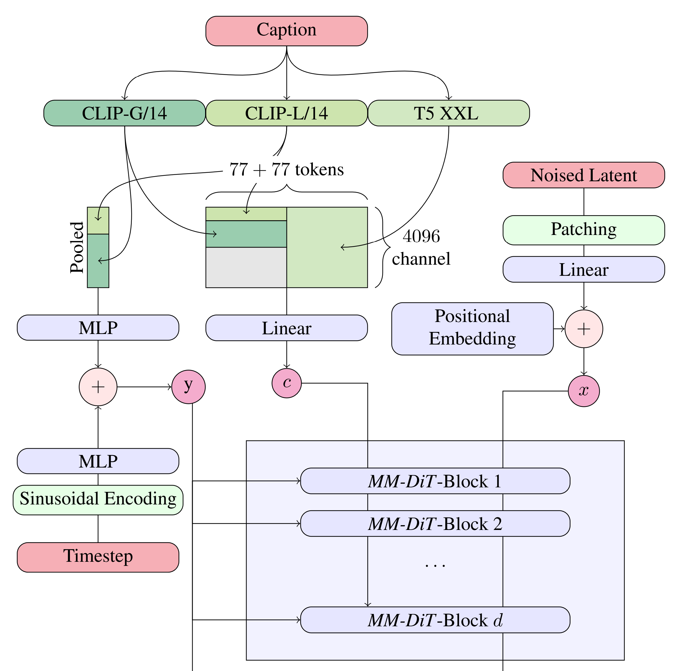

# Diffusion Transformer notes

Mainly following the [Stable Diffusion 3](<https://arxiv.org/pdf/2403.03206>) and [FLUX.1](<https://arxiv.org/pdf/2507.09595>) papers. They are based on the starting [DiT](<https://arxiv.org/pdf/2212.09748>) which is based off the original [ViT](<https://arxiv.org/pdf/2010.11929>) papers.

## Inputs

**3 Inputs:**

* $x$ data or latent
* $y$ conditioning
* $t$ time steps



### Data

So data is put into conv2d VAE then patchified. Then we add 2D RoPE for positional embedding.
Not sure how and what 2D RoPE actually works?

Stable Diffusion 3:

We do a sin-cos positional embedding and then never again in the transformer blocks.

FlUX.1:

**I am following this.**
Assign (h, w) positional ids on each patch and then 2D RoPE(Q, K) for every layer

### Time Steps

Time steps are put through Sinusoidal Encoding or Fourier Frequency Transform Embedding. Used the MIT lecture note equations.
$$\text{TimeEmb}(t) = \sqrt{\frac{2}{d}} \begin{bmatrix} \cos(2\pi w_1 t) & \cdots & \cos(2\pi w_{d/2} t) & \sin(2\pi w_1 t) & \cdots & \sin(2\pi w_{d/2} t) \end{bmatrix}^T, \ t \in \mathbb{R}^{B} $$

$$w_i = w_{\min} \left( \frac{w_{\max}}{w_{\min}} \right)^{\frac{i-1}{d/2 - 1}} , \quad i = 1, \dots, d/2.$$

We then put that through another linear layer so $W \in \mathbb{R}^{B\times D}, \ \text{TimeEmb}(t) \in \mathbb{R}^{B\times T} \Longrightarrow \text{TimeEmb}(t)W \in \mathbb{R}^{B \times D}$.

### Conditioning

This is where I split off and use the FLUX.1 conditioning due to less compute and simplicity. We use 3 models: T5 XXL, CLIP-G/14, and CLIP-L/14.

$$c \in \mathbb{R}^{B}$$

So there are actually two outputs for CLIP: sequences and pooled. The pooled outputs from both CLIP models are concatenated and combined which then sent through an **MLP** to then be combined with the time embeddings.

$$\text{Pooled-CLIP}(c) = \text{CLIP-L}(c) \ \odot \ \text{CLIP-S}(c) \in \mathbb{R}^{B\times (L+S)}$$

In Stable Diffusion 3, the T5 and CLIP, you concatenate both the CLIP sequences and pad it to match the dimensionality of the T5 sequence. However, in the FLUX.1, you can get away with only the T5 which I will be doing. After we have our sequence, we will send that through a **linear** layer to project it to our mmDiT input dimension.

$$\text{T5}(c) \in \mathbb{R}^{B\times T \times C}$$

CLIP and T5 HF models

```txt
openai/clip-vit-base-patch32
openai/clip-vit-base-patch16
openai/clip-vit-large-patch14
laion/CLIP-ViT-bigG-14-laion2B-39B-b160k
```

```txt
google/t5-v1_1-small
google/t5-v1_1-base
google/t5-v1_1-large
google/t5-v1_1-xl
google/t5-v1_1-xxl
```

## MLP block

Simple upscale 4 times then downscale back to original dimension. Two linear layers with non-linearlity activation. 
Very unclear on the technical details as there another MLP in the mmDiT block. I'll check out the FLUX.1 for mmDiT block.
I'm guessing the MLP is just a projection to the proper dimension.

## tasks today

* conv vae
* positional embedding